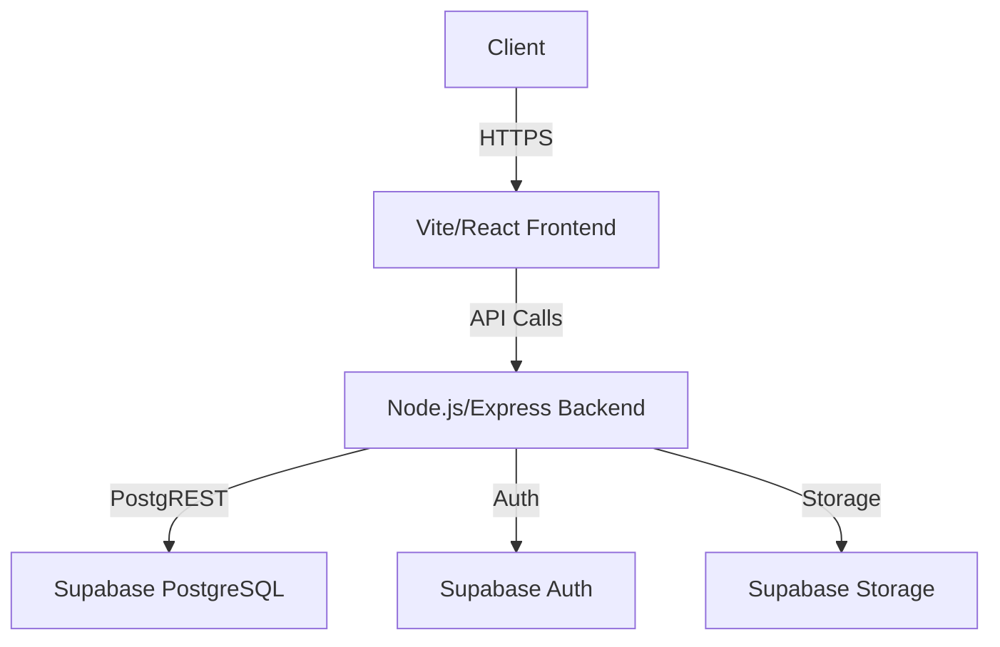
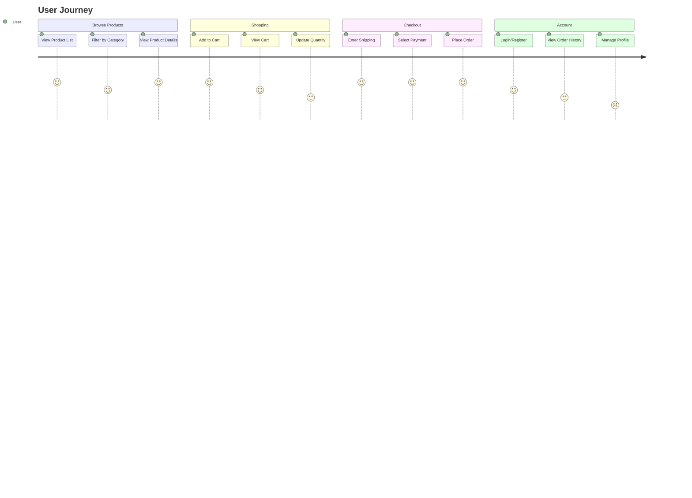
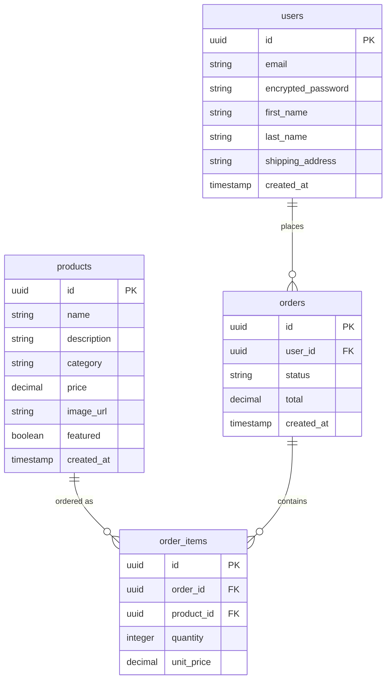

# Mediterranean Food - Technical Architecture Specification

## 1. System Overview


## 2. Technology Stack

### Frontend
- **React.js**: Component-based architecture ideal for e-commerce UIs
- **Vite**: Fast build tool for modern React apps
- **React Router**: Client-side routing
- **React Query**: Data fetching and state management
- **Tailwind CSS**: Utility-first CSS framework for rapid UI development

### Backend
- **Node.js/Express.js**: Lightweight and performant API server
- **Supabase Client**: Official SDK for Supabase integration
- **JWT Authentication**: For secure user sessions

### Database
- **Supabase PostgreSQL**: Fully managed PostgreSQL with realtime capabilities
- **PostgREST**: Auto-generated REST API from database schema
- **Row-Level Security**: Fine-grained access control

## 3. Key User Flows



## 4. Database Schema



## 5. API Endpoints

| Endpoint | Method | Description | Auth Required |
|----------|--------|-------------|---------------|
| `/api/products` | GET | List all products | No |
| `/api/products/:id` | GET | Get single product | No |
| `/api/products/category/:category` | GET | Filter by category | No |
| `/api/cart` | GET | Get cart contents | Yes |
| `/api/cart` | POST | Add to cart | Yes |
| `/api/cart/:id` | PUT | Update cart item | Yes |
| `/api/cart/:id` | DELETE | Remove from cart | Yes |
| `/api/checkout` | POST | Process checkout | Yes |
| `/api/orders` | GET | List user orders | Yes |
| `/api/orders/:id` | GET | Get order details | Yes |
| `/auth/register` | POST | Register new user | No |
| `/auth/login` | POST | Login user | No |

## 6. Frontend Component Structure

```
src/
├── components/
│   ├── Layout/ (Header, Footer)
│   ├── Product/ (Card, List, Details)
│   ├── Cart/ (MiniCart, CartPage)
│   ├── Checkout/ (Steps, PaymentForm)
│   ├── Auth/ (Login, Register)
│   └── UI/ (Buttons, Modals, Loaders)
├── pages/
│   ├── Home
│   ├── Products
│   ├── ProductDetail
│   ├── Cart
│   ├── Checkout
│   └── Account
├── hooks/ (Custom hooks)
├── context/ (React context)
├── services/ (API clients)
└── utils/ (Helpers)